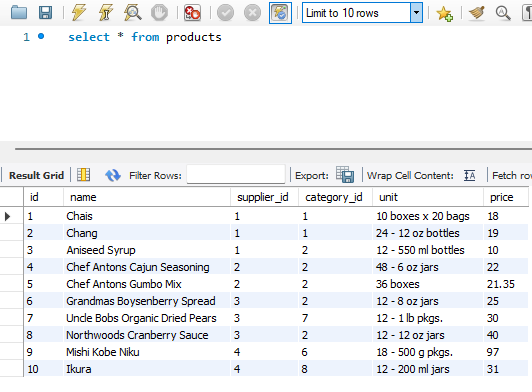
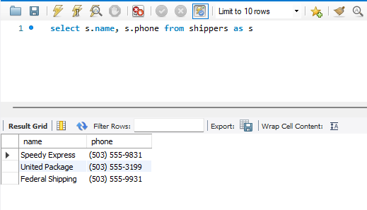
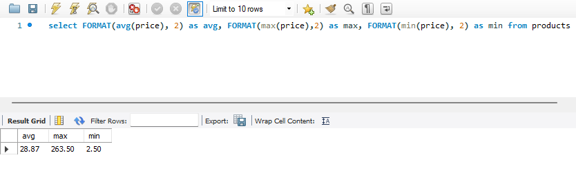
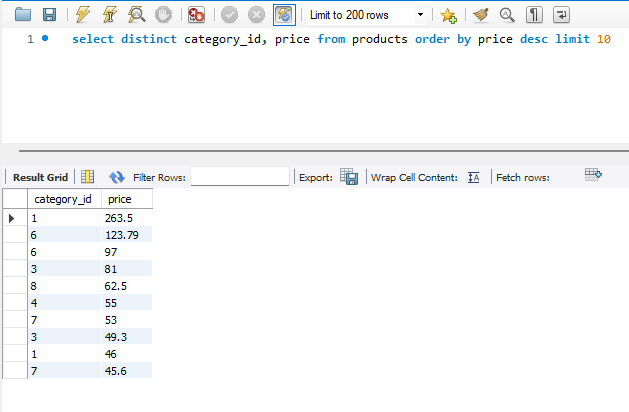
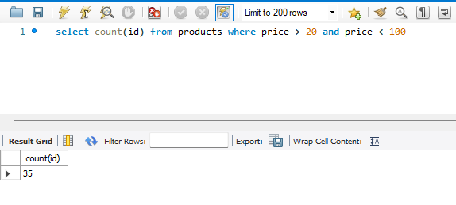
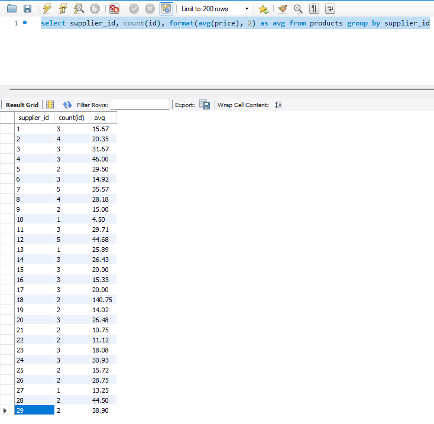

# Домашнє завдання до Теми 3. Завантаження даних та основи SQL. DQL команди 

## 1. Напишіть SQL команду, за допомогою якої можна:
вибрати всі стовпчики (За допомогою wildcard “*”) з таблиці products;
вибрати тільки стовпчики name, phone з таблиці shippers, та перевірте правильність її виконання в MySQL Workbench.

### вибрати всі стовпчики (За допомогою wildcard “*”) з таблиці products:
```
select * from products
```

### вибрати тільки стовпчики name, phone з таблиці shippers, та перевірте правильність її виконання в MySQL Workbench.
```
select s.name, s.phone from shippers as s
```


## 2. Напишіть SQL команду, за допомогою якої можна знайти середнє, максимальне та мінімальне значення стовпчика price таблички products, та перевірте правильність її виконання в MySQL Workbench*.*
```
select FORMAT(avg(price), 2) as avg, FORMAT(max(price),2) as max, FORMAT(min(price), 2) as min from products
```


## 3. Напишіть SQL команду, за допомогою якої можна обрати унікальні значення колонок category_id та price таблиці products.
Оберіть порядок виведення на екран за спаданням значення price та виберіть тільки 10 рядків. Перевірте правильність виконання команди в MySQL Workbench.

```
select distinct category_id, price from products order by price desc limit 10
```


## 4. Напишіть SQL команду, за допомогою якої можна знайти кількість продуктів (рядків), які знаходиться в цінових межах від 20 до 100, та перевірте правильність її виконання в MySQL Workbench.
```
select count(id) from products where price > 20 and price < 100
```


## 5. Напишіть SQL команду, за допомогою якої можна знайти кількість продуктів (рядків) та середню ціну (price) у кожного постачальника (supplier_id), та перевірте правильність її виконання в MySQL Workbench.
```
select supplier_id, count(id), format(avg(price), 2) as avg from products group by supplier_id
```
